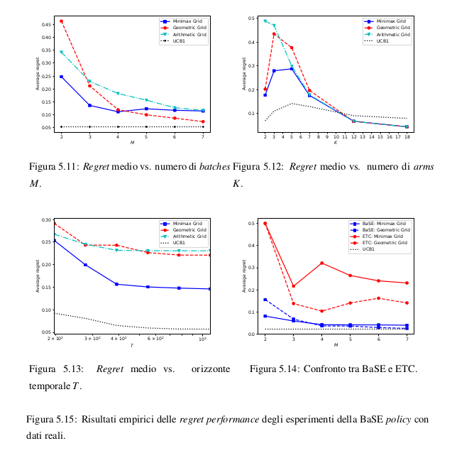

# BMaB
<h4>Batched Multi-armed Bandits Problem - Analisi critica</h4>

Artificial Intelligence Course Project on the study and experimental results' analysis of **Batched Multi-armed Bandits Problem** scientific paper (Zijun Gao, Yanjun Han, Zhimei Ren amd Zhengqing Zhou).

Link to paper: [papers.nips.cc/paper/8341-batched-multi-armed-bandits-problem.pdf](http://papers.nips.cc/paper/8341-batched-multi-armed-bandits-problem.pdf)

Paper PDF: [NeurIPS-2019-batched-multi-armed-bandits-problem-Paper.pdf](./NeurIPS-2019-batched-multi-armed-bandits-problem-Paper.pdf)

Document: [AI_Take_Home.pdf](./AI_Take_Home.pdf)

<h5>Empirical results of regret performances of experiments of the BaSE policy published in the studied paper:</h5>

<h5>Empirical results of regret performances of experiments of the BaSE policy on random data:</h5>

<h5>Empirical results of regret performances of experiments of the BaSE policy on real data:</h5>

